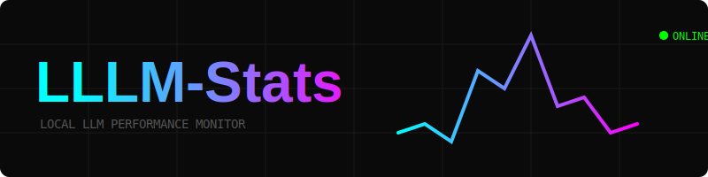

# LLLM-Stats 🚀



A real-time Terminal User Interface (TUI) for monitoring **Local LLM** performance metrics. It tracks throughput (TPS), hardware health (VRAM/GPU), and historical trends across multiple providers.

## Features
- 📊 **Real-time TPS Gauge:** Watch your model's generation speed as it happens.
- 📉 **Performance History:** Aggregated trends (Daily/Weekly/Monthly) with 15m/1h/1d buckets.
- 💾 **Persistent Analytics:** Saves all stats to a local SQLite database (`~/.lllm-stats/stats.db`).
- 🤖 **Provider Support:** Extensible architecture currently supporting **LM Studio** (Ollama coming soon).
- 🍏 **Apple Silicon Native:** High-precision GPU and Unified Memory monitoring via `ioreg`.

## Usage

### TUI Mode (Real-time)
Launch the interactive dashboard:
```bash
npm start
```
*Controls:* 
- `[v]` to toggle between Daily, Weekly, and Monthly views.
- `[q]` to exit.

### Summary Mode (Quick Stats)
Get a text-based summary and exit:
```bash
node index.js -s
```

## Technical Architecture
- **Provider Pattern:** All server-specific logic (logs, CLI calls) is isolated in `src/providers/`.
- **Intelligent Backfill:** Automatically parses missing log data on startup without duplicate processing.
- **Stack:** Node.js, Blessed, SQLite3, Chokidar.

## License
MIT
